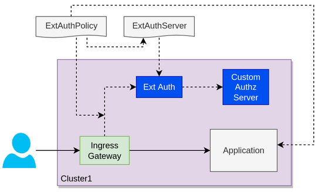

Using the PassThroughAuth server for authorizing requests and for appending additional headers to it.


1. [Deploy some sample services](#Deploysomesampleservices)
1. [Deplying the ext-auth passthrough service](#Deplyingtheext-authpassthroughservice)
1. [Configure Gloo Mesh to use the passthrough service for authorization](#ConfigureGlooMeshtousethepassthroughserviceforauthorization)
* * [HTTP Headers can be appended for requests to the upstream](#HTTPHeaderscanbeappendedforrequeststotheupstream)
* * [Requests can be rejected by the PassThroughAuth service](#RequestscanberejectedbythePassThroughAuthservice)




###  1. <a name='Deploysomesampleservices'></a>Deploy some sample services

Let's create a nanespace where we can run our backend services.

```
# should have been created earlier in the workshop
# kubectl create ns bookinfo-backends
```

If you don't have any services running, you can run this sample service where you can target requests.
```
kubectl -n bookinfo-backends apply -f ./backend-service.yaml
```

###  2. <a name='Deplyingtheext-authpassthroughservice'></a>Deplying the ext-auth passthrough service

In Gloo Mesh you can configure the ExtAuth service to pass evaluation to another custom built component. 
In this example the passthrough service will do these two actions:

- Reject requeststhat have the HTTP header `authorization: deny me` will reject the request.
- Inject the `x-random-value` header with a random int value 


Apply it to the cluster:

```
kubectl -n bookinfo-backends apply -f ext-auth-passthrough-service.yaml
```

###  3. <a name='ConfigureGlooMeshtousethepassthroughserviceforauthorization'></a>Configure Gloo Mesh to use the passthrough service for authorization

> *NOTE:* We suppose that you are using the following ExtAuthServer created in the workspace.
```
apiVersion: admin.gloo.solo.io/v2
kind: ExtAuthServer
metadata:
  name: ext-auth-server
  namespace: bookinfo-backends
spec:
  destinationServer:
    ref:
      name: ext-auth-service
      namespace: gloo-mesh-addons
      cluster: cluster1
    port:
      name: grpc
```

Then you can make use of this server using a ExtAuthPolicy that uses the passThroughAuth service that we dpeloyed earlier.

```
apiVersion: security.policy.gloo.solo.io/v2
kind: ExtAuthPolicy
metadata:
  name: policy
  namespace: bookinfo-backends
spec:
  applyToDestinations:
  - selector:
      name: backend
      namespace: bookinfo-backends
      cluster: cluster1
  config:
    server:
      name: ext-auth-server
      namespace: bookinfo-backends
    glooAuth:
      configs:
      - passThroughAuth:
          grpc:
            address: example-grpc-auth-service.bookinfo-backends.svc.cluster.local:9001
```

####  3.1. <a name='HTTPHeaderscanbeappendedforrequeststotheupstream'></a>HTTP Headers can be appended for requests to the upstream

Make a request:
```
kubectl run -i -n backend --rm --restart=Never dummy30 \
--image=curlimages/curl --command -- sh -c 'curl -v backend.bookinfo-backends:8080'

```

```
> GET / HTTP/1.1
> Host: backend.global
> User-Agent: curl/7.84.0-DEV
> Accept: */*
> 
{
  "name": "backend-cluster1",
  "owner": "pam",
  "uri": "/",
  "type": "HTTP",
  "ip_addresses": [
    "10.102.0.29"
  ],
  "start_time": "2022-07-24T18:01:24.777296",
  "end_time": "2022-07-24T18:01:24.777354",
  "duration": "57.341µs",
  "body": "Hello from backend",
  "code": 200
}
* Mark bundle as not supporting multiuse
< HTTP/1.1 200 OK
< date: Sun, 24 Jul 2022 18:01:24 GMT
< content-length: 290
< content-type: text/plain; charset=utf-8
< x-envoy-upstream-service-time: 14
< server: envoy
```

And to ensure that the header was sent to the upstream you can print the logs of the backend service which prints the incoming request details. We will grep for the added header only.

```
k logs -n backend deploy/backend | grep x-random-value
x-random-value: 81
```

*Summary:* A new header was added to the request by the PassThroughAuth service.


####  3.2. <a name='RequestscanberejectedbythePassThroughAuthservice'></a>Requests can be rejected by the PassThroughAuth service

For the demo, we reject all requests with the header used below.

```
kubectl run -i -n backend --rm --restart=Never dummy30 \
--image=curlimages/curl --command -- sh -c 'curl -v backend.backend:8080 -H "authorization: deny me"'

> GET / HTTP/1.1
> Host: backend.backend:8080
> User-Agent: curl/7.84.0-DEV
> Accept: */*
> authorization: deny me
> 
* Mark bundle as not supporting multiuse
< HTTP/1.1 403 Forbidden
< date: Sun, 24 Jul 2022 18:12:49 GMT
< server: envoy
< content-length: 0
< x-envoy-upstream-service-time: 18
```